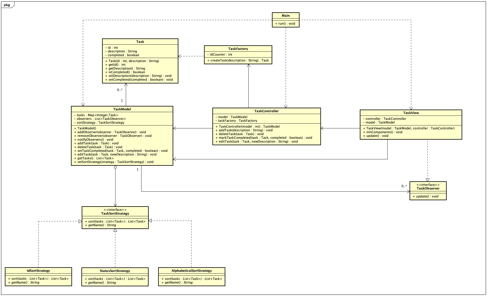

# Task Manager – Start Document

### Author
David Hlavacek - 5094879

### Programming Language
Java

### Application Description
TaskManagerApp is a to-do list application that allows users to manage their tasks. Users can add tasks, mark them as completed, edit, and delete them. Other minor features are available such as toggling the visibility of completed tasks, or a counter of completed and pending tasks. The application uses the MVC pattern to separate the presentation layer, the business logic, and the flow of data. Additionally, it makes use of the Factory pattern for creating tasks and the Observer pattern for automatically updating the UI when changes occur.

### Design Patterns Selected
1. MVC Pattern
2. Factory Pattern
3. Observer Pattern

### Diagram

### Functionalities (Using MoSCoW Method)
- **Must have:**
  - Add new tasks.
  - Mark tasks as completed.
- **Should have:**
  - Delete tasks.
  - Edit task.
  - Toggle visbility of completed tasks.
  - Persistent storage for tasks.
- **Could have:**
  - Setting priority of tasks.
  - Folders for different type of tasks.
- **Won't have:**
  - Multi-user collaboration features.

### Remarks
- The app showcases its functionalities and the usage of design patterns to solve problems. Therefore, we do not implement persisten storage... for now.
- I had fun with the styling.
- Put some effort into the UX.
- After a grade, I will extend this app, such as clicking on tasks opens up a dialog where you can set extra informations.
